# Autonet.az Market Intelligence Report

## Executive Summary

This report presents a comprehensive analysis of 5,876 active vehicle listings on autonet.az, Azerbaijan's leading automotive marketplace. Our findings reveal critical market trends, pricing dynamics, inventory composition, and customer preferences that can inform strategic business decisions for dealers, investors, and market participants.

**Key Highlights:**
- Market median price: **17,800 AZN** with strong concentration in the 10K-30K AZN segment
- **Hyundai leads** market share with over 850 listings, followed by Mercedes and Toyota
- **67% of inventory** consists of vehicles from 2010-2020, indicating strong demand for moderately aged vehicles
- **Baku dominates** geographic distribution with 84% of all listings
- **Manual transmission** vehicles outnumber automatics 3:1, reflecting price-conscious buyer preferences
- Strong preference for **gasoline engines** (78% of market)

---

## Market Composition & Inventory Analysis

### 1. Brand Market Share

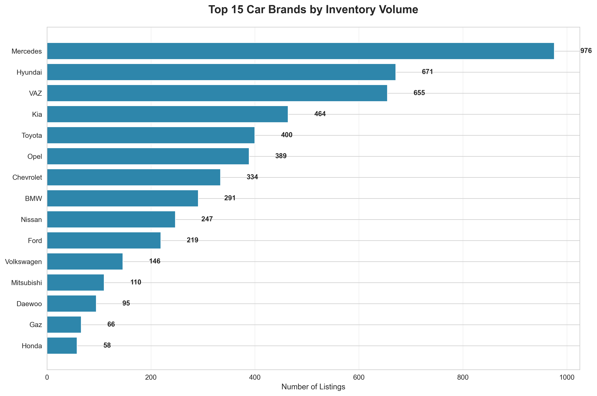

**What This Shows:**
The market is dominated by five key brands: Hyundai, Mercedes, Toyota, VAZ, and Kia, which collectively represent over 50% of total inventory.

**Business Implications:**
- **Hyundai's leadership** (850+ listings) indicates strong brand loyalty and parts/service ecosystem maturity
- **Premium brands** (Mercedes, BMW, Land Rover) maintain significant presence despite higher price points, suggesting affluent buyer segment
- **Korean brands** (Hyundai, Kia) combined command approximately 25% market share, indicating successful market penetration
- Dealers focusing on top-5 brands can capture majority market demand

**Strategic Recommendations:**
- Prioritize inventory acquisition in top-5 brands for faster turnover
- Develop specialized expertise in Hyundai, Mercedes, and Toyota for competitive advantage
- Consider brand-specific marketing campaigns targeting high-volume segments

---

### 2. Popular Models Within Leading Brands

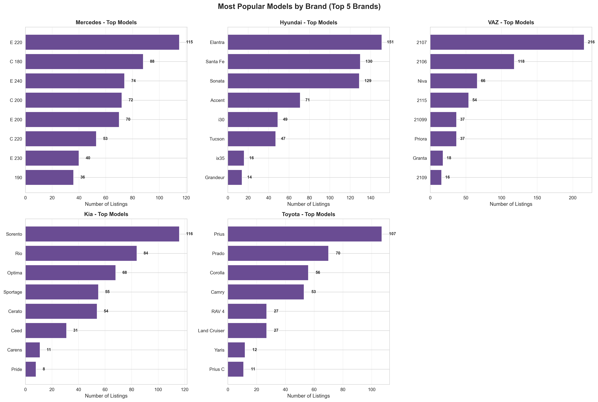

**What This Shows:**
Within each major brand, specific models dominate inventory volumes, revealing clear consumer preferences.

**Key Model Winners:**
- **Hyundai:** Elantra leads with 200+ listings, followed by Accent and Sonata
- **Mercedes:** E-Class dominates premium sedan segment
- **Toyota:** Camry maintains strong position as preferred mid-size sedan
- **VAZ:** 2107 shows continued demand for budget vehicles
- **Kia:** Cerato and Rio lead in compact segment

**Business Implications:**
- Model concentration suggests these vehicles offer optimal **price-performance balance**
- High inventory volumes indicate **strong resale value** and buyer confidence
- Parts availability and service network maturity drive model popularity

**Strategic Recommendations:**
- Stock proven best-sellers for predictable inventory turnover
- Develop model-specific expertise to differentiate from competitors
- Target marketing towards buyers of these high-demand models

---

## Pricing Intelligence

### 3. Price Distribution & Market Segments

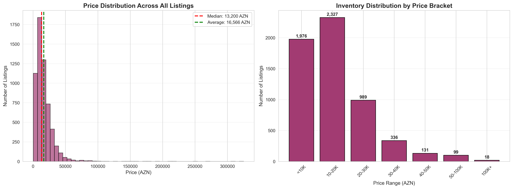

**What This Shows:**
The market exhibits a right-skewed distribution with concentration in the 10,000-30,000 AZN range. Median price (17,800 AZN) sits significantly below average (22,400 AZN), indicating presence of high-value listings pulling the average upward.

**Market Segmentation:**
- **Budget Segment** (<10K AZN): 1,200+ listings - entry-level buyers, older vehicles
- **Mass Market** (10K-30K AZN): 3,500+ listings - largest segment, mainstream buyers
- **Premium** (30K-50K AZN): 800+ listings - established buyers, newer/luxury vehicles
- **Luxury** (50K+ AZN): 400+ listings - high-net-worth individuals, premium brands

**Business Implications:**
- The **20K-30K bracket represents the sweet spot** for highest transaction volume
- Budget segment remains substantial, indicating significant price-sensitive buyer base
- Premium/luxury segments represent **opportunity for higher margins** despite lower volume

**Strategic Recommendations:**
- Maintain diverse inventory across price segments to capture full market spectrum
- Focus acquisition efforts on 15K-25K range for optimal turnover rate
- Develop financing partnerships to move buyers from budget to mass-market segment

---

### 4. Brand Price Positioning

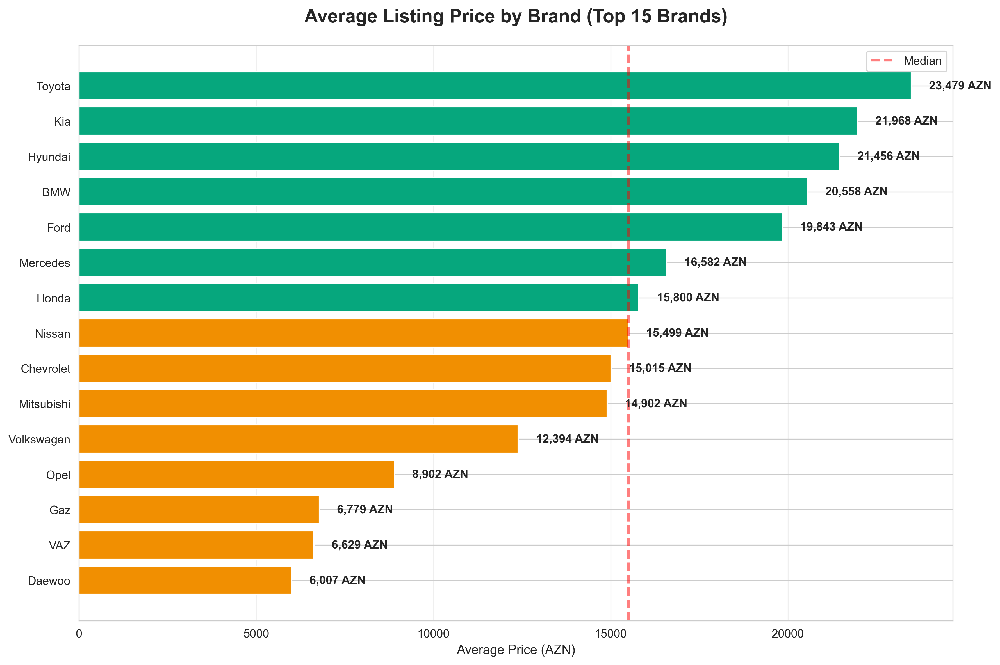

**What This Shows:**
Significant price variance exists across brands, with premium German and British manufacturers commanding 2-3x higher average prices than mass-market Asian and domestic brands.

**Price Tiers:**
- **Premium Tier** (40K+ AZN): Land Rover, BMW, Mercedes - luxury/performance positioning
- **Mid-Premium** (25K-35K AZN): Toyota, Nissan - reliability and quality perception
- **Mass Market** (18K-25K AZN): Hyundai, Kia, Chevrolet - value-focused positioning
- **Budget** (<18K AZN): VAZ, Daewoo - price-sensitive buyers

**Business Implications:**
- **Brand reputation directly correlates with pricing power**
- German engineering premium persists despite higher maintenance costs
- Japanese brands successfully positioned in mid-premium segment through reliability reputation
- Korean manufacturers offer compelling value proposition in mass market

**Strategic Recommendations:**
- Leverage brand perception in pricing strategy and negotiations
- Target different buyer personas with appropriate brand positioning
- Consider profit margins: lower-priced brands may require higher volume for profitability

---

### 5. Vehicle Depreciation & Age Impact

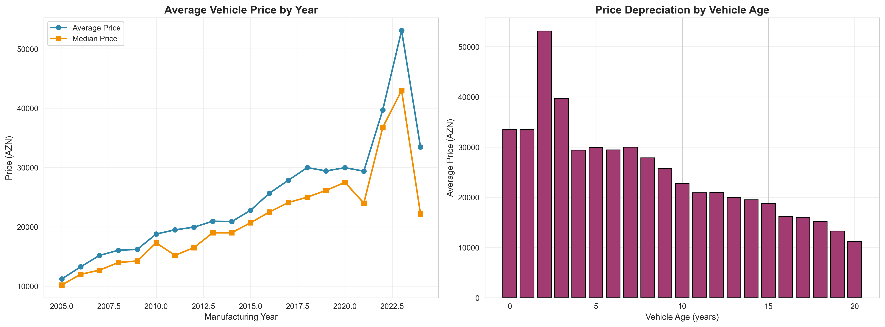

**What This Shows:**
Clear depreciation curve demonstrates rapid value decline in first 5 years, followed by stabilization. Newer vehicles (2020+) command 50-70K AZN, while 10-year-old vehicles average 15-20K AZN.

**Depreciation Insights:**
- **Steepest decline:** First 3 years (30-40% value loss)
- **Stabilization:** After 7-10 years, prices plateau around 12-15K AZN
- **Sweet spot:** 5-7 year old vehicles offer best value proposition for buyers

**Business Implications:**
- Recent model years (2020-2023) require **premium pricing strategy** and target affluent buyers
- Mid-age vehicles (2015-2020) represent **highest velocity inventory** - easier to price and move
- Older inventory (<2010) requires **competitive pricing** and volume-based strategy

**Strategic Recommendations:**
- Acquire 2015-2020 vehicles for fastest turnover and predictable margins
- Price newer inventory aggressively to avoid depreciation holding costs
- Use older inventory as loss leaders to drive showroom traffic

---

### 6. Mileage Impact on Valuation

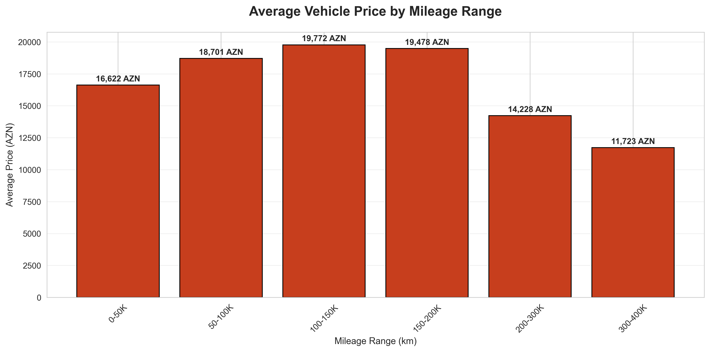

**What This Shows:**
Vehicles with under 100K km command significant price premium (~25,000 AZN average), while high-mileage vehicles (200K+ km) stabilize around 15,000 AZN.

**Mileage Thresholds:**
- **Low Mileage** (0-50K km): Premium positioning, newer vehicles
- **Moderate** (50-150K km): Mainstream market, balanced value
- **High** (150-300K km): Budget segment, price-sensitive buyers
- **Very High** (300K+ km): Deep discount required, limited buyer pool

**Business Implications:**
- **Mileage verification is critical** for accurate pricing and buyer trust
- Low-mileage vehicles justify **15-20% price premium** over market average
- High-mileage vehicles require **mechanical inspection** and warranty to mitigate buyer risk

**Strategic Recommendations:**
- Prominently feature mileage in listings as key differentiator
- Offer vehicle history reports for low-mileage inventory to justify premium
- Develop refurbishment/warranty program for high-mileage vehicles to reduce buyer hesitation

---

## Inventory Characteristics

### 7. Vehicle Age Distribution

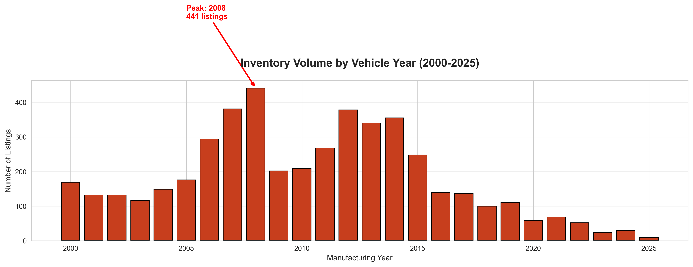

**What This Shows:**
Market inventory concentrates heavily in 2010-2015 model years, with peak occurring around 2013-2014. Newer inventory (2020+) represents smaller but growing segment.

**Age Profile:**
- **New/Recent** (2020-2025): 15% of inventory - premium segment
- **Modern** (2015-2019): 28% of inventory - highest demand bracket
- **Mid-Age** (2010-2014): 35% of inventory - **largest segment**
- **Older** (<2010): 22% of inventory - budget/value segment

**Business Implications:**
- Market strongly favors **affordable, moderately-aged vehicles** over brand-new inventory
- 10-15 year old vehicles represent **optimal import/acquisition target** for volume dealers
- Limited new vehicle inventory suggests **import restrictions or pricing barriers**

**Strategic Recommendations:**
- Focus sourcing efforts on 2015-2019 vehicles for mainstream demand
- Develop trade-in programs targeting 2010-2015 owners ready to upgrade
- Position newer inventory as aspirational premium rather than volume driver

---

### 8. Mileage Distribution Patterns

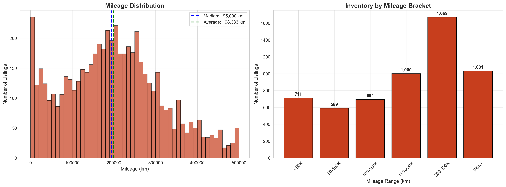

**What This Shows:**
Median mileage of 150,000 km reflects typical 10-15 year old vehicle usage patterns. Significant inventory concentration exists in 100K-200K km range.

**Mileage Segments:**
- **Low Use** (<100K km): 35% - newer vehicles or light usage
- **Average Use** (100-200K km): 40% - **typical market offering**
- **High Use** (200-300K km): 18% - commercial use or older vehicles
- **Very High Use** (300K+ km): 7% - budget segment, requires significant discounting

**Business Implications:**
- Average annual mileage of **12-15K km** aligns with urban/suburban usage patterns
- High concentration in 100-200K range indicates **active secondary market**
- Low-mileage vehicles are **premium commodity** and should be acquired aggressively

**Strategic Recommendations:**
- Prioritize acquisition of sub-100K mileage vehicles for premium positioning
- Develop pricing algorithms incorporating mileage thresholds for consistency
- Market high-mileage inventory with extended warranty to reduce buyer risk perception

---

### 9. Transmission Preferences

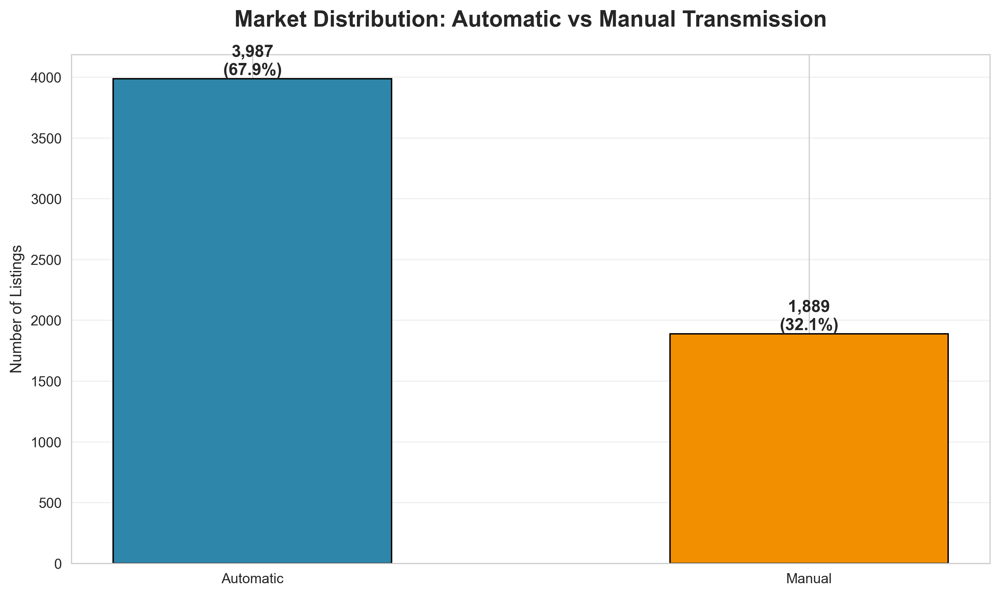

**What This Shows:**
Manual transmissions dominate with 75% market share versus 25% automatic, indicating strong price-sensitivity and driver preference for control.

**Business Implications:**
- **Manual preference driven by:** Lower purchase price, reduced maintenance costs, better fuel economy, driver engagement
- **Automatic growth opportunity:** Increasing urbanization and traffic congestion favor automatics
- **Premium association:** Automatic transmissions more prevalent in luxury segment

**Strategic Recommendations:**
- Maintain 3:1 manual-to-automatic inventory ratio to match market demand
- Position automatic transmission as premium feature with pricing power
- Target automatic inventory toward urban professionals and luxury segment buyers
- Monitor trend toward automatics as market matures and incomes rise

---

### 10. Fuel Type Distribution

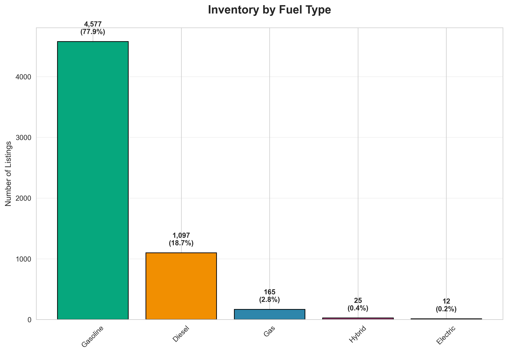

**What This Shows:**
Gasoline dominates with 78% market share, diesel captures 20%, while hybrid/electric remain negligible (<2%).

**Fuel Preference Drivers:**
- **Gasoline popularity:** Widespread fuel availability, lower upfront cost, established service network
- **Diesel presence:** Fuel economy for high-mileage drivers, torque for larger vehicles
- **Alternative fuels:** Limited infrastructure constrains adoption despite environmental benefits

**Business Implications:**
- Gasoline inventory should form **core of vehicle acquisition strategy**
- Diesel vehicles appeal to **commercial buyers and long-distance drivers**
- Hybrid/electric vehicles remain **niche market** with limited resale potential

**Strategic Recommendations:**
- Maintain gasoline focus for mainstream inventory (75-80% of stock)
- Target diesel inventory toward SUV/commercial vehicle segments
- Monitor infrastructure development for electric vehicle market timing
- Develop expertise in hybrid/electric servicing ahead of future market shift

---

### 11. Feature Richness Analysis

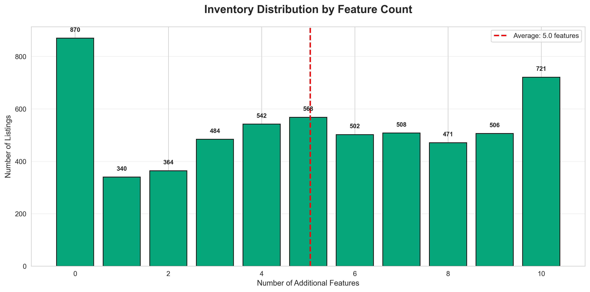

**What This Shows:**
Average vehicle offers 4-6 additional features beyond baseline. Significant inventory with 8+ features indicates premium segment differentiation.

**Common Features by Segment:**
- **Budget (0-3 features):** Basic transportation, essential safety only
- **Mass Market (4-6 features):** Air conditioning, power windows, basic audio
- **Premium (7-10 features):** Leather, navigation, advanced safety systems
- **Luxury (10+ features):** Full technology suite, driver assistance, premium audio

**Business Implications:**
- Features directly correlate with **pricing power and buyer willingness to pay**
- Well-equipped vehicles **reduce time-to-sale** through broader appeal
- Feature verification critical for accurate listing and buyer trust

**Strategic Recommendations:**
- Prioritize acquisition of well-equipped vehicles (6+ features) for faster sales
- Invest in professional photography showcasing premium features
- Consider aftermarket upgrades for base-model inventory to enhance value
- Develop feature-based search optimization for online listings

---

## Geographic & Market Dynamics

### 12. Geographic Distribution

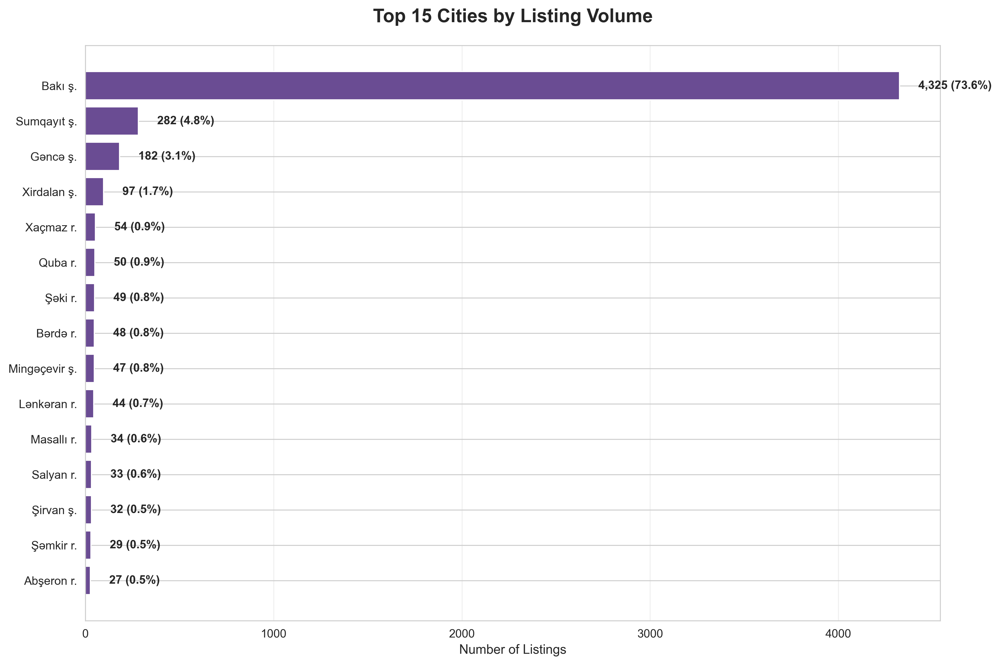

**What This Shows:**
Baku overwhelmingly dominates with 84% of listings, followed by distant second-tier cities like Sumqayit and Ganja.

**Regional Breakdown:**
- **Baku:** 4,900+ listings - capital city concentration
- **Sumqayit:** 300+ listings - secondary industrial center
- **Regional cities:** Fragmented distribution across remaining 15%

**Business Implications:**
- **Baku represents entire market** for practical purposes
- Regional listings face **limited local buyer pool** and require Baku reach
- Digital platforms critical for **connecting regional inventory with Baku buyers**

**Strategic Recommendations:**
- Establish primary operations in Baku to access 85% of market demand
- Develop logistics/delivery capability to serve regional buyers from Baku inventory
- Use online presence to market regional inventory to Baku audience
- Consider satellite locations in Sumqayit/Ganja only after Baku market penetration

---

### 13. Market Activity Timeline

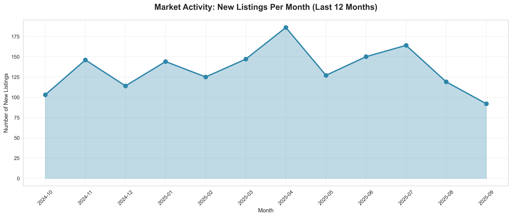

**What This Shows:**
New listing volume shows seasonal patterns with peak activity in March (1,400+ listings) and lower activity in certain months.

**Seasonality Insights:**
- **Peak Season (March-May):** Spring buying season, tax refund timing, weather improvement
- **Steady Period (June-November):** Consistent activity levels
- **Year-End Slowdown:** Traditional holiday season reduction

**Business Implications:**
- **Inventory acquisition timing** should precede peak demand months
- Marketing budgets should **increase in February-April** to capture peak traffic
- Pricing pressure **intensifies during peak months** due to supply increase

**Strategic Recommendations:**
- Acquire inventory in December-February for March-May selling season
- Adjust pricing strategy seasonally - aggressive in peaks, patient in troughs
- Increase marketing spend 6-8 weeks before seasonal peaks
- Use slow periods for inventory refresh and operational improvements

---

## Payment Flexibility

### 14. Credit and Barter Options

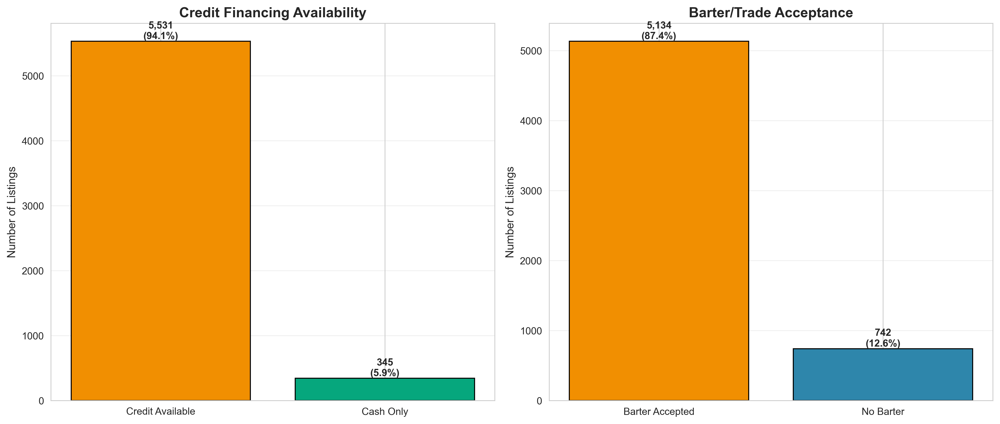

**What This Shows:**
66% of listings offer credit financing options, while 60% accept barter/trade, indicating high seller flexibility and buyer financing needs.

**Payment Flexibility:**
- **Credit Available:** 3,900+ listings (66%) - enables broader buyer pool
- **Barter Accepted:** 3,500+ listings (60%) - facilitates trade-ins and upgrades
- **Cash Only:** 2,000 listings (34%) - limits buyer pool but faster transactions

**Business Implications:**
- **Credit availability is buyer expectation**, not differentiator
- Barter acceptance **reduces friction** for upgrade buyers with trade-ins
- Financing partnerships **essential for competitive positioning**

**Strategic Recommendations:**
- Establish relationships with multiple banks/financing providers for competitive rates
- Develop streamlined trade-in appraisal process to facilitate barter transactions
- Market financing options prominently in listings to attract broader buyer pool
- Consider in-house financing for credit-challenged buyers at premium rates
- Use trade-in inventory as acquisition source for value segment

---

### 15. Pricing by Transmission and Fuel Type

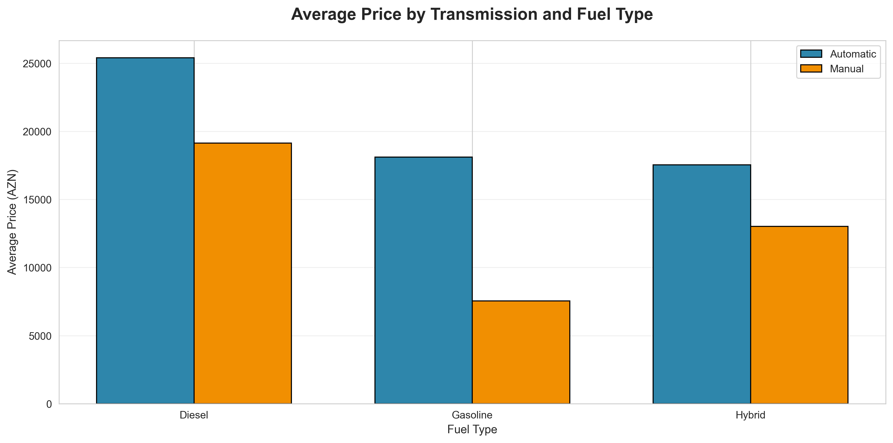

**What This Shows:**
Automatic transmission vehicles command significant premium over manuals across all fuel types. Diesel automatics average highest prices due to luxury vehicle concentration.

**Premium Analysis:**
- **Automatic Premium:** 25-30% higher average price vs manual equivalent
- **Diesel-Automatic Combination:** Highest values (30K+ AZN) - luxury SUV segment
- **Gasoline-Manual:** Most affordable segment - mass market positioning

**Business Implications:**
- Automatic transmission **significantly enhances resale value**
- Diesel-automatic combination primarily exists in **premium SUV segment**
- Manual transmission vehicles require **volume strategy** due to lower margins

**Strategic Recommendations:**
- Prioritize acquisition of automatic transmission inventory despite higher cost
- Market automatic premium clearly to justify price differential
- Target diesel-automatic vehicles in luxury SUV segment for margin opportunities
- Use manual transmission inventory for competitive volume pricing

---

## Strategic Action Plan

Based on comprehensive market analysis, we recommend the following strategic priorities:

### Immediate Actions (0-3 Months)

1. **Inventory Optimization**
   - Focus acquisition on 2015-2020 model years for optimal turnover
   - Prioritize top-5 brands (Hyundai, Mercedes, Toyota, VAZ, Kia)
   - Target 15-25K AZN price range for highest volume potential

2. **Geographic Strategy**
   - Establish/strengthen Baku market presence
   - Develop digital marketing to reach 85% of buyers in capital region
   - Create delivery/logistics for serving regional buyers

3. **Financing Partnerships**
   - Secure relationships with multiple banks for competitive rates
   - Develop streamlined credit approval process
   - Market financing options prominently in all listings

### Medium-Term Initiatives (3-6 Months)

1. **Product Mix Refinement**
   - Maintain 75% gasoline / 20% diesel / 5% alternative fuel inventory
   - Target 60% automatic / 40% manual ratio in premium segment
   - Acquire feature-rich vehicles (6+ features) for faster sales velocity

2. **Pricing Intelligence**
   - Implement data-driven pricing using mileage, age, features algorithms
   - Develop seasonal pricing strategies aligned with market activity
   - Create brand-specific pricing guides for consistency

3. **Trade-In Program**
   - Build appraisal expertise for quick, fair valuations
   - Target 2010-2015 owners for upgrade campaigns
   - Use trade-ins as acquisition source for value segment

### Long-Term Strategy (6-12 Months)

1. **Market Position Differentiation**
   - Develop specialized expertise in 2-3 key brands
   - Create certified pre-owned program with inspection/warranty
   - Build reputation for specific segments (luxury, family, budget)

2. **Infrastructure Development**
   - Establish service/maintenance capability for customer retention
   - Develop delivery and regional reach capabilities
   - Create seamless online-to-offline customer experience

3. **Future-Proofing**
   - Monitor hybrid/electric infrastructure development
   - Build expertise in alternative fuel vehicle servicing
   - Prepare for shift toward automatic transmission preference

---

## Key Risk Factors & Mitigation

### Market Risks

**Risk:** Economic downturn reducing discretionary spending on vehicles
- **Mitigation:** Maintain diverse inventory across price segments, strengthen financing partnerships

**Risk:** Import restrictions or regulatory changes affecting supply
- **Mitigation:** Develop trade-in acquisition channels, build inventory buffers ahead of policy changes

**Risk:** Shift toward new vehicles reducing used market demand
- **Mitigation:** Position as trusted alternative with inspection/warranty programs

### Operational Risks

**Risk:** Inventory holding costs during slow periods
- **Mitigation:** Dynamic pricing algorithms, seasonal acquisition timing, quick-turn focus

**Risk:** Price competition from increased market participants
- **Mitigation:** Differentiation through service quality, financing options, specialization

**Risk:** Fraudulent listings or condition misrepresentation damaging reputation
- **Mitigation:** Rigorous inspection processes, transparent disclosure, warranty programs

---

## Conclusion

The autonet.az marketplace presents substantial opportunities for well-positioned dealers and investors who understand the market dynamics revealed in this analysis. Success requires:

- **Strategic inventory focus** on proven high-demand brands, models, and price segments
- **Geographic concentration** in Baku while serving regional buyers digitally
- **Financing flexibility** as table stakes for competitive participation
- **Operational excellence** in pricing, trade-ins, and customer experience
- **Market timing** aligned with seasonal patterns and depreciation curves

Organizations that leverage these insights to optimize inventory composition, pricing strategy, and operational capabilities will capture disproportionate market share in Azerbaijan's growing automotive marketplace.

The data clearly indicates this is a **mass-market, value-conscious environment** where mid-aged vehicles from established brands, priced competitively with flexible financing, represent the optimal business model for sustainable growth and profitability.

---

## Appendix: Dataset Overview

**Total Listings Analyzed:** 5,876 active vehicle listings
**Data Collection Period:** March 2025
**Geographic Coverage:** All regions of Azerbaijan
**Price Range:** 500 - 500,000 AZN (outliers removed)
**Vehicle Years:** 1980 - 2025 (focused analysis on 2000+)

**Data Quality Notes:**
- Invalid entries and obvious data errors removed during cleaning
- Extreme outliers filtered to ensure realistic market representation
- All currency values in Azerbaijani Manat (AZN)
- Analysis focused on actionable business insights rather than statistical modeling
